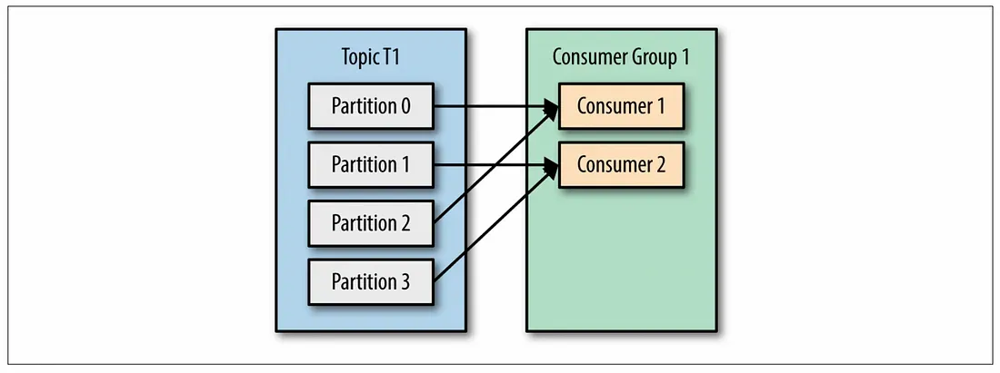

# 카프카 KAFKA
## 카프카 정의 및 배경
- 대규모 실시간 데이터 스트리밍을 위한 분산 메세징 시스템
- 고성능 분산 메시지 스트리밍 플랫폼. 
- 대량의 데이터를 실시간으로 처리하고 전송하기 위해 설계되었다.
- 데이터의 흐름을 효율적으로 관리하고, 다양한 시스템 간의 데이터 통신을 원활하게 하기 위해 개발되었다.
- 데이터 손실, 지연, 복잡한 데이터 파이프라인 구축 등을 해결하기 위해 고안되었다.

## 용어 정리
### 메시지 큐(Message Queue)
- 분산 환경에서 시스템 간 데이터를 교환하기 위해 사용되는 통신기법.
- 데이터의 생산자와 소비자 간의 비동기적 통신을 가능하게 하는 시스템
- 카프카는 메시지 큐의 기능을 강화하여 수많은 소비자가 동시에 데이터를 소비할 수 있도록 설계되었다.
- 메시지 큐의 한계는 producer가 발행한 메시지를 보관하고 있는 큐에서 consumer가 메시지를 사용했을 때 다른 소비자는 해당 메시지를 재상용 할 수 없다. 
이러한 한계를 해결하기 위해 카프카는 pub/sub 모델을 활용.
  
  

### producer 프로듀서
- 메세지를 카프카 브로커에 적재(발행)하는 서비스
### consumer 컨슈머
- 카프카 브로커에 적재된 메시지를 읽어오는 서비스
### broker 브로커
- 하나의 카프카 서버를 브로커라고 한다.
- Producer의 메시지를 받아 offset 지정 후 디스크에 저장
- Consumer의 파티션 Read에 응답해 디스크의 메시지 전송

### cluster 클러스터 
- 여러 대의 분산 서버를 네트워크로 연결하여 하나의 서버처럼 동작하게 만드는 개념을 서버 클러스터링이라고 한다.
- 여러 대의 서버를 클러스터로 묶게 되면, 특정 서버에서 장애가 발생하더라도 다른 서버에서의 외부의 요청을 처리할 수 있기 때문에 서비스 전체의 가용성에는 문제가 발생하지 않는 장점이 있다.
- 카프카도 여러 대의 서버(broker)를 묶어서 하나의 서비스(cluster)로 움직인다.
### replication
- 클러스터의 가용성을 보장하는 개념
- 각 파티션의 레플리카를 만들어 백업 및 장애 극복
  - leader replica : 각 파티션은 1개의 리더 replica를 가짐. producer, consumer 요청은 리더를 통해 처리되게 하여 일관성 보장
  - follower replica : 리더를 제외한 replica. 단순히 리더의 메시지를 복제해 백업한다. 파티션의 리더가 중단되는 경우 팔로워 중 하나를 새로운 리더로 선출한다.

### topic 토픽
- 메시지를 분류하는 기준
- N개의 파티션으로 구성
### partition 파티션
- 대용량 트래픽을 파티션의 개수만큼 병렬로 처리할 수 있어 빠른 처리 가능.
- 같은 파티션의 메시지에 대해서 순차 처리를 보장
- 하나의 파티션은 하나의 컨슈머에서만 컨슘할 수 있다.(순차 처리를 보장하기 위해)

### message 메시지
- 카프카의 데이터의 기본 단위
- 바이트 배열의 데이터로 간주
- <Key, Message> 형태로 구성
- 어떠한 데이터 형태이든지 저장이 가능
- 읽어들인 후 적절한 형태로 변환하여 사용

### offset 오프셋
- 컨슈머 그룹이 메시지를 어디까지 읽었는지 저장하는 값
- commit offset : 여기까지의 오프셋은 처리했다는 것을 확인하는 오프셋
- current offset : 컨슈머가 어디까지 메시지를 읽었는지 나타내는 오프셋

### commit 커밋
- 카프카 내부 토픽에 오프셋 정보를 저장하고, 오프셋 값을 업데이트 하는 것
- 자동커밋 : 설정한 주기에 따라 poll()을 호출할 때 자동으로 마지막 오프셋을 커밋한다.
- 수동커밋 : 메시지 처리가 완벽하게 이루어지지 않으면 메시지를 읽지 않은 것으로 간주하는 경우 사용.

### consumer lag 컨슈머 랙
- 오프셋과 컨슈머가 가져간 오프셋과의 차이

### consumer group 컨슈머 그룹
- 하나의 토픽에 발행된 메시지를 여러 서비스가 컨슘하기 위해 그룹을 설정

### rebalancing 리밸런싱
- 한 컨슈머로부터 다른 컨슈머로 파티션 소유권이 이전되는 것
- 컨슈머 그룹의 가용성과 확장성을 확보해주는 개념
- 리밸런싱이 발생하는 상황
  - 컨슈머 그룹 내에 새로운 컨슈머가 추가될 때
  - 특정 컨슈머에 문제가 생겨 중단될 때
  - 해당 컨슈머 그룹이 바라보는 토픽 내에 새로운 파티션이 생길 때

## 장점
- 다중 컨슈머 기능 지원으로 여러 개의 컨슈머 그룹이 서로간의 상호 간섭 없이 각자의 오프셋으로 순차처리가 가능하다.
- 같은 토픽 내의 메시지를 다수의 애플리케이션이 개별적으로 읽을 수 있다.
- 높은 처리량과 확장성을 제공한다.
- 컨슈머가 메시지를 가져가지 못하면 컨슈머가 메시지를 다시 가져간다.

## 주의할 점
### 파티션
- 파티션 수를 줄이기 위해서는 새로운 파티션을 만들어서 기존 파티션을 모두 하나에 옮긴 후 나머지를 없애야 함.
- 늘리고 줄이는 것이 비용이기 때문에 파티션을 늘릴 때는 신중해야한다.
### at least once / at once
- at least once : 컨슈머에서 메시지를 받을 때 에러가 나면 offset 위치가 변경되지 않는다. 이후 컨슈머가 다시 받아간다. 백엔드에서는 중복 처리가 될 수 있다.
- at once : 한번만 실행되어야 하는 경우 사용
### 프로듀서, 파티션, 컨슈머 수에 따른 카프카 데이터 흐름

- 한 파티션은 하나의 컨슈머에서만 컨슘할 수 있다.
- 하나의 파티션에 여러개의 컨슈머가 메시지를 컨슘하면 메시지 처리의 순서를 보장할 수 없다.

- 컨슈머 그룹 : 하나의 메시지가 N개의 서비스로 전파되어야 할 때 N개의 서비스를 그룹별로 관리할 수 있다.
- ex) 주문 완료 메시지를 여러 서비스에 보내야 하는 경우
- 컨슈머 그룹1 은 상품 서비스와 연결하고 컨슈머 그룹2는 결제 서비스와 연결할 수 있다.
- 다른 서비스에서도 주문 완료 메시지를 컨슘하고 싶으면 컨슈머 그룹을 추가하면 된다.

- 파티션의 개수가 그룹 내 컨슈머 개수보다 많으면 잉여 파티션의 경우 메시지가 소비될 수 없다.
- 4개의 파티션, 2개의 컨슈머가 있는 경우 하나의 컨슈머가 2개의 파티션에서 메시지를 가져온다.(그런 경우에도 처리량은 조금 떨어지지만 파티션 단위의 순서 보장이 된다.)

- 파티션 수와 컨슈머 수가 1:1인 경우 각각의 파티션의 메시지를 각각의 컨슈머가 가져올 수 있으니 가장 효율이 좋은 케이스이다.

- 파티션의 수보다 컨슈머의 수가 더 많은 경우 하나의 파티션에서 다수의 컨슈머가 메시지를 가져오게 되면 안된다. (순차 보장이 안된다.)
- 하나의 파티션은 하나의 컨슈머에서만 수집이 가능하다.
- 파티션의 수보다 컨슈머의 수가 더 많으면 노는 컨슈머가 생긴다.

## outbox 패턴
- 프로듀서가 카프카에 메시지 적재를 실패하는 경우에 어떻게 처리할 것인지에 대한 것
- 메시지를 보내야 한다는 사실을 원천 데이터베이스와 같은 트랜잭션으로 처리함.
- 데이터베이스에서 실패하면 outbox 데이터에 적재도 같이 실패하게 된다.

## 참고
- 항해 발제 자료
- https://medium.com/@greg.shiny82/apache-kafka-%EA%B0%84%EB%9E%B5%ED%95%98%EA%B2%8C-%EC%82%B4%ED%8E%B4%EB%B3%B4%EA%B8%B0-343ad84a959b
- https://www.elancer.co.kr/blog/detail/738
- https://ggop-n.tistory.com/90
- https://medium.com/@greg.shiny82/%EC%8B%A4%EB%AC%B4-%EA%B4%80%EC%A0%90%EC%97%90%EC%84%9C%EC%9D%98-apache-kafka-%ED%99%9C%EC%9A%A9-023d468f9182