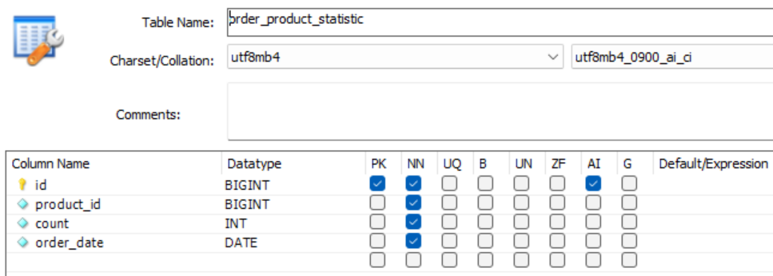

### 병목 예상 query
3일간 인기상품 top5를 조회하는 query가 JOIN과 GROUP BY + SUM()을 하는 관계로 병목이 있을 것으로 예상됩니다. 

```SELECT p.*  
FROM product p  
JOIN (  
  SELECT p.id, sum(op.count) as cnt  
  FROM product AS p  
  LEFT JOIN order_product AS op ON p.id = op.product_id  
  WHERE op.create_at > DATE_SUB(NOW(), INTERVAL 3 DAY)  
  GROUP BY p.id  
  ORDER BY SUM(op.count) DESC  
  LIMIT 5) AS best
ON p.id = best.id;
```


### Top5 상품 조회 시 기존 query
```
EXPLAIN SELECT p.*  
FROM product p  
JOIN (  
  SELECT p.id, sum(op.count) as cnt  
  FROM product AS p  
  LEFT JOIN order_product AS op ON p.id = op.product_id  
  WHERE op.create_at > DATE_SUB(NOW(), INTERVAL 3 DAY)  
  GROUP BY p.id  
  ORDER BY SUM(op.count) DESC  
  LIMIT 5) AS best 
ON p.id = best.id;  
```
- query 소요시간 : 8.219sec  


### 병목 
기존 order_product에 full table scan이 일어나고 있어 병목이 예상됩니다. explain 표에도 using temporary, using filesort를 사용하여 병목 현상이 일어납니다.

### ADD INDEX `best` (`create_at` DESC) 추가 후


explain 표를 보면 filtered가 33.33 -> 50.00으로 바뀌었습니다. 이는 인덱스 적용 효과가 있는 것으로 볼 수 있습니다. 인덱스 효과가 크지 않아 날짜별 create_at 을 조회해 보니 모든 데이터의 create_at이 '2025-07-31', '2025-08-01'로만 이루어져있었습니다. 날짜가 좀 더 다양할 경우 더 많은 데이터가 필터링 되어 성능이 더 향상될 것으로 생각됩니다.
- query 소요시간 : 6.359sec

### 통계 테이블 사용 시
```
CREATE TABLE order_product_statistic(  
  id BIGINT AUTO_INCREMENT PRIMARY KEY,  
  product_id BIGINT NOT NULL,  
  count INT NOT NULL,  
  order_date DATE NOT NULL);  
```


위와 같은 통계테이블을 생성하였습니다. 
```
SELECT p.*  
FROM product p  
JOIN (  
  SELECT product_id FROM order_product_statistic  
  WHERE order_date > DATE_SUB(NOW(), INTERVAL 3 DAY)  
  GROUP BY product_id  
  ORDER BY SUM(count) DESC  
  LIMIT 5) AS best 
ON p.id = best.product_id;
```

- query 소요시간 : 0.062sec

using temporary, using filesort를 사용하고 있지만, 날짜별로 통계를 저장해 총 데이터 수가 줄어들어 소요시간이 많이 줄어든 것을 확인할 수 있었습니다. 현재는 날짜가 2일밖에 없어 차이가 더 극명히 나타났을 것으로 예상됩니다. 

### 통계 테이블에 order_date에 인덱스 적용

- query 소요시간 : 0.078sec

날짜로 인덱스를 적용하면 효과가 좋을 것으로 예상했지만, 현재 들어가있는 데이터 상으로 모든 날짜를 조회하게 되어 효과가 없었습니다. 날짜가 쌓일 경우 다시 테스트 해볼 여지가 있을 것 같습니다.
