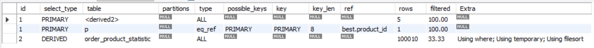

## 1.병목이 예상되는 기존 Query
3일간 인기상품 top5를 조회하는 query가 JOIN과 GROUP BY + SUM()을 하는 관계로 병목이 있을 것으로 예상됩니다. 

```SELECT p.*  
FROM product p  
JOIN (  
  SELECT p.id, sum(op.count) as cnt  
  FROM product AS p  
  LEFT JOIN order_product AS op ON p.id = op.product_id  
  WHERE op.create_at > DATE_SUB(NOW(), INTERVAL 3 DAY)  
  GROUP BY p.id  
  ORDER BY SUM(op.count) DESC  
  LIMIT 5) AS best
ON p.id = best.id;
```

---
## 2. 기존 Queyr 실행 계획 분석
```
EXPLAIN SELECT p.*  
FROM product p  
JOIN (  
  SELECT p.id, sum(op.count) as cnt  
  FROM product AS p  
  LEFT JOIN order_product AS op ON p.id = op.product_id  
  WHERE op.create_at > DATE_SUB(NOW(), INTERVAL 3 DAY)  
  GROUP BY p.id  
  ORDER BY SUM(op.count) DESC  
  LIMIT 5) AS best 
ON p.id = best.id;  
```
- query 소요시간 : 8.219sec  
- ```order_product``` 테이블에 Full Table Scan 발생
- ```Using temporary```, ```Using filesort``` 확인
- > 대량 데이터 기준으로 정렬 및 그룹 연산 비용이 매우 크며, ```order_product``` 테이블이 병목 지점으로 작용함을 확인했습니다.


## 3. 인덱스 추가 후 성능 비교
# 적용한 인덱스
```
ALTER TABLE order_product
ADD INDEX `best` (`create_at` DESC)
```


- filtered 값이 33.33 → 50.00으로 증가
- 인덱스를 통해 일부 데이터 필터링 효과 확인
- query 소요시간 : 6.359sec
다만, create_at 값이 실제로는 2025-07-31, 2025-08-01 두 날짜에만 몰려 있어 인덱스 선택도가 낮아 성능 개선 효과가 제한적이었습니다.

## 4. 통계 테이블 도입
```
CREATE TABLE order_product_statistic(  
  id BIGINT AUTO_INCREMENT PRIMARY KEY,  
  product_id BIGINT NOT NULL,  
  count INT NOT NULL,  
  order_date DATE NOT NULL);  
```


주문 발생 시점에 일 단위로 집계된 데이터를 저장하도록 설계했습니다.
```
SELECT p.*  
FROM product p  
JOIN (  
  SELECT product_id FROM order_product_statistic  
  WHERE order_date > DATE_SUB(NOW(), INTERVAL 3 DAY)  
  GROUP BY product_id  
  ORDER BY SUM(count) DESC  
  LIMIT 5) AS best 
ON p.id = best.product_id;
```

- query 소요시간 : 0.062sec

using temporary, using filesort를 사용하고 있지만, 날짜별로 통계를 저장해 총 데이터 수가 줄어들어 소요시간이 많이 줄어든 것을 확인할 수 있었습니다. 현재는 날짜가 2일밖에 없어 차이가 더 극명히 나타났을 것으로 예상됩니다. 

### 통계 테이블에 order_date에 인덱스 적용

- query 소요시간 : 0.078sec

날짜로 인덱스를 적용하면 효과가 좋을 것으로 예상했지만, 현재 들어가있는 데이터 상으로 모든 날짜를 조회하게 되어 효과가 없었습니다. 날짜가 쌓일 경우 다시 테스트 해볼 여지가 있을 것 같습니다.
